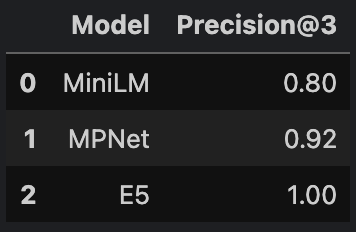
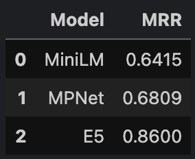
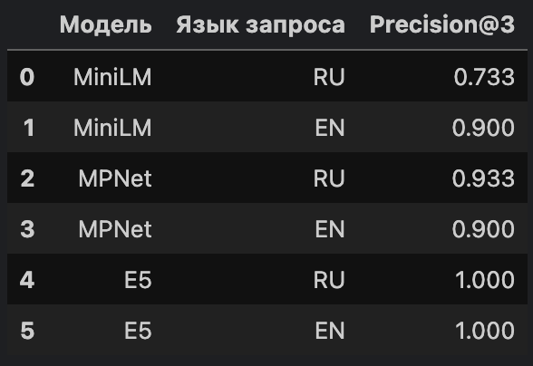
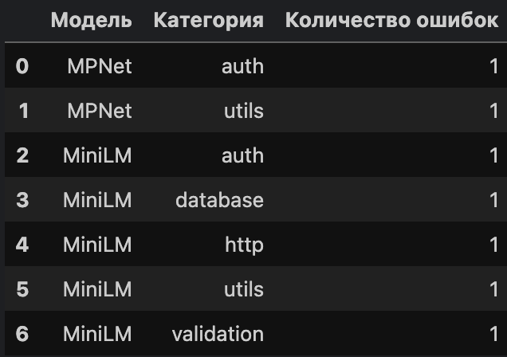
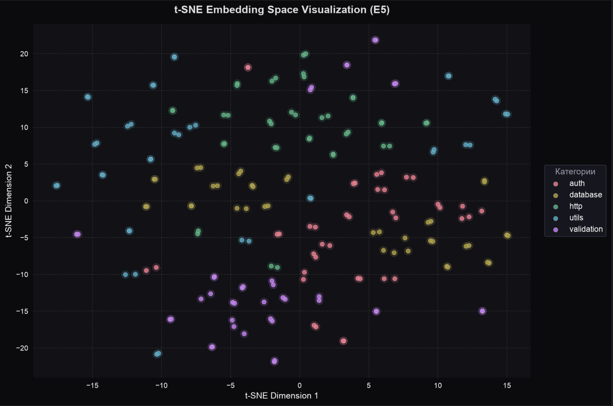

## Concept Navigator

В рамках практической работы реализован прототип 
системы семантического поиска по исходному коду на 
основе ****embedding-моделей****.

****Цель проекта**** - сравнение качества различных моделей 
эмбеддингов при решении задачи поиска релевантных 
фрагментов кода по текстовому запросу.

---

## Актуальность

Актуальность задачи обусловлена ограничениями классического 
текстового поиска, который опирается на точное совпадение 
слов и плохо работает в случаях семантического 
перефразирования. Например, запрос «обработка ошибок» 
может не находить соответствующие участки кода, если в 
них используется терминология вида ```exception_handler```. 
Семантический поиск решает эту проблему за счёт 
преобразования текста в векторные представления (эмбеддинги), 
в которых близкие по смыслу объекты располагаются рядом 
в многомерном пространстве.

---

## Выбор моделей

Для сравнения были выбраны три модели:

- ```paraphrase-multilingual-MiniLM-L12-v2```
- ```paraphrase-multilingual-mpnet-base-v2```
- ```intfloat/multilingual-e5-base```

---

## TOP-3

Поиск релевантных фрагментов осуществлялся с 
использованием косинусного сходства между векторами 
запроса и корпуса. Для каждого вопроса выбирались три 
наиболее похожих фрагмента (Top-3).

---

## Оценка моделей

Качество моделей оценивалось с помощью метрики 
Precision@3, которая показывает долю вопросов, для 
которых правильный ответ оказался среди трёх наиболее 
релевантных результатов. Для более детальной оценки 
качества ранжирования используется показатель MRR. 
В отличие от Precision@3, данная метрика анализирует не 
только факт нахождения правильного результата, но и то, 
насколько высоко он расположен в списке найденных 
элементов. Чем раньше система возвращает корректный 
ответ, тем больше значение метрики. Максимальный вклад 
в итоговый результат достигается в случае, когда 
релевантный фрагмент занимает первую позицию в выдаче.

---

## Анализ ошибок

Дополнительно проводился анализ качества поиска 
отдельно для русскоязычных и англоязычных запросов, 
а также анализ ошибок по тематическим категориям, что 
позволило выявить наиболее проблемные области моделей.

---

## t-SNE

Для визуализации структуры эмбеддингов использовался 
алгоритм t-SNE, который позволил отобразить многомерные 
векторы в двумерном пространстве. Полученные кластеры 
демонстрируют степень семантической близости различных 
категорий кода.

---

## Структура проекта

```commandline
ConceptNavigator
├── semantic_search
│   ├── code_corpus.json
│   ├── eval_questions.json
│   └── starter.ipynd
├── .gitignore
├── README.md
└── requirements.txt
```

---

## Описание датасета

Датасет предназначен для разработки и оценки системы 
семантического поиска по корпусу программного кода 
(кейс «Навигатор по смыслу», версия 1.0). Он включает 
200 функций на Python и Java, сгруппированных по 
5 тематическим категориям, и 25 тестовых вопросов на 
русском и английском языках.

---

## Структура датасета

```commandline
dataset_v1.0/
├── categories.json       # 5 категорий кода
├── code_corpus.json      # 200 функций (100 Python + 100 Java)
└── eval_questions.json   # 25 тестовых вопросов с эталонными ответами
```

---

## Описание файлов

**code_corpus.jon** - корпус функций для индексирования. Содержит 
200 записей в виде массива JSON.

### Поля каждой функции

| Поле            | Тип    | Описание                                          |
|-----------------|--------|---------------------------------------------------|
| `id`            | string | Уникальный идентификатор: `func_001` … `func_200` |
| `language`      | string | Язык программирования: `python` или `java`        |
| `function_name` | string | Имя функции/метода                                |
| `code`          | string | Исходный код функции                              |
| `description`   | string | Описание назначения функции на русском языке      |
| `category`      | string | Ключ категории из `categories.json`               |

### Распределение по языкам

- `func_001` – `func_100` → `language: "python"`
- `func_101` – `func_200` → `language: "java"`

### Пример записи

```json
{
  "id": "func_001",
  "language": "python",
  "function_name": "verify_jwt_token",
  "code": "def verify_jwt_token(token: str, secret: str) -> dict:\n    \"\"\"Проверяет JWT-токен и возвращает payload или причину невалидности.\"\"\"\n    try:\n        payload = jwt.decode(token, secret, algorithms=[\"HS256\"])\n        return {\"valid\": True, \"data\": payload}\n    except jwt.ExpiredSignatureError:\n        return {\"valid\": False, \"error\": \"expired\"}\n    except jwt.InvalidTokenError:\n        return {\"valid\": False, \"error\": \"invalid\"}",
  "description": "Проверяет JWT-токен и возвращает payload или причину невалидности.",
  "category": "auth"
}
```

---

****eval_questions.json**** - Тестовые вопросы для оценки 
качества retrieval. Содержит 25 записей в виде массива JSON.

### Поля каждого вопроса

| Поле               | Тип    | Описание                                   |
|--------------------|--------|--------------------------------------------|
| `question_id`      | string | Уникальный идентификатор: `q_01` … `q_25`  |
| `query`            | string | Поисковый запрос на естественном языке     |
| `language`         | string | Язык запроса: `ru` или `en`                |
| `correct_chunk_id` | string | ID эталонной функции из `code_corpus.json` |

### Пример записи

```json
{
  "question_id": "q_01",
  "query": "как проверить, истёк ли токен?",
  "language": "ru",
  "correct_chunk_id": "func_001"
}
```

### Категории кода

| Ключ         | Название                     | Цвет      | Описание                                           |
|--------------|------------------------------|-----------|----------------------------------------------------|
| `auth`       | Аутентификация и авторизация | `#E74C3C` | JWT, пароли, сессии, OAuth, 2FA, права доступа     |
| `database`   | Работа с базой данных        | `#3498DB` | CRUD, транзакции, миграции, индексы, bulk-операции |
| `http`       | HTTP-клиенты и API           | `#2ECC71` | REST-вызовы, retry, webhook, upload, кэширование   |
| `validation` | Валидация и парсинг          | `#F39C12` | email, телефон, ИНН, СНИЛС, ISO-даты, URL          |
| `utils`      | Утилиты и хелперы            | `#9B59B6` | форматирование, кэш, slugify, sanitize             |

---

## Что не входит в датасет

- **Нет обучающего (train) набора.** Датасет предназначен исключительно для индексирования корпуса и оценки retrieval-качества.
- **Нет разбивки train/test по функциям.** Все 200 функций индексируются; по 25 вопросам считаются метрики.
- **Нет предвычисленных эмбеддингов.** Выбор модели для построения векторных представлений — на усмотрение команды.
- **Нет ограничений на стек.** Участники свободны в выборе библиотек, моделей и способа хранения индекса.

---

## Версионирование

| Версия   | Дата   | Изменения                        |
|----------|--------|----------------------------------|
| 1.0      | 2026   | Первый публичный выпуск датасета |

---

## Результаты исследования

### ТАБЛИЦА Precision@3:


### ТАБЛИЦА MRR:


### ТАБЛИЦА МУЛЬТИЯЗЫЧНОСТИ:


### ТАБЛИЦА ОШИБОК ПО КАТЕГОРИЯМ:


### t-SNE
